> Def. 8.1.1: Gdzieś tam warto zaznaczyć, że te formuły mogą mieć zmienne wolne (w innych kontekstach "teoria" zawiera tylko zdania). Również chyba warto dopisać czym jest "universal closure", bo to nie jest nigdzie powiedziane.

Dopisałem do definicji.

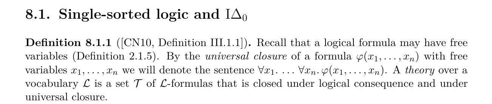

> W definicji 8.1.3 jest jeszcze axiom C, ale w Def. 8.1.5 do Peano bierzesz tylko B1-B8, więc rola tego C jest niejasna.

Dopisałem po co tam jest.

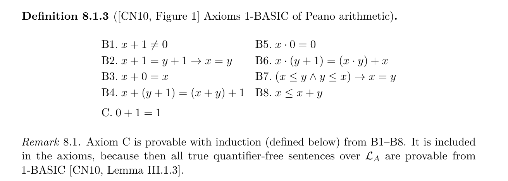

> Def. 8.1.6: "bounded" formulas - trzeba napisać (przypomnieć) co to znaczy. To było zdefiniowane gdzieś na początku pracy i tylko dla two-sorted logic (a tu jest 1 sort).

Dopisane.

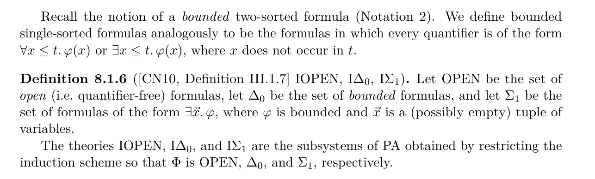

> Def. 8.1.7 (i): "Phi-definable in T", ale T nie pojawia się nigdzie w definicji - podejrzane. Ale może faktycznie tak ma być.

Akurat tutaj T występuje w definicji - tylko ponad tym punktem (i)

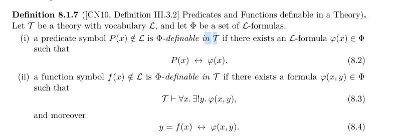

> Zajrzałem do CN10 (przez link na końcu twojej pracy), ale tam jest zupełnie inna numeracja, np definicja 8.1.7 to 3.27 a nie III.3.2.
> Ale zakładam, że ta numeracja jest z jakiejś bardziej oficjalnej wersji książki.

Tutaj popełniłem błąd - początkowo zrobiłem taki dziwny manewr, że w cytowaniach odnosiłem się do numeracji z draftu, zacytowałem oryginał, a link podałem do PDFa draftu. A potem zacząłem cytować oryginał z numeracją oryginału, a draft z numeracją draftu. A link do pdfa draftu został w bibtexie oryginału... Usunąłem link do draftu z bibtexa oryginału. Nie dopisuję numeracji draftu w tym rozdziale bounded arithmetic, bo już i tak jestem spóźniony - książka i tak jest dostępna na anna's archive.

> Theorem 8.4: Jak dwa pierwsze zdania mają się do siebie? Czy "is provable in .." oraz "is a theorem of .." to to samo? Skoro indukcja (jak rozumiem, bez żadnych ograniczeń) jest dowodliwa w V^i dla każdego i, to w szczególności sla i=0 oraz dla Delta_0.

Dopisałem o co chodzi, czyli że jeśli mamy comprehension dla zbioru formuł X, to mamy też indukcję dla tego zbiuru:

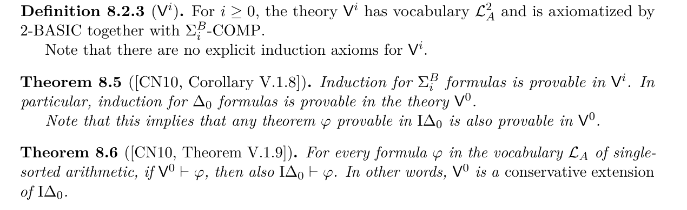

> Def. 8.2.4: Dlaczego "(p-bounded)" jest w nawiasach? Raczej należy je usunąć.

Racja. Usunąłem.

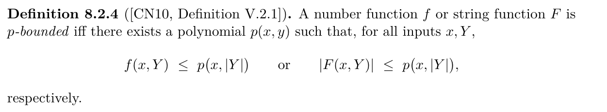

> Rozdział 8.3: Gdzieś tu na początku powinien pojawić się link do formalizacji. Teraz jest tylko gdzieś we wstępie do pracy; niech tu będzie ponownie.

Dopisałem takie zdanie. I skoro już je wpisałem to upewniłem się że faktycznie te ścieżki tam prowadzą, tj. dodałem do tego repo jakiś jeden plik który był w innym repo, a się na niego powoływałem.

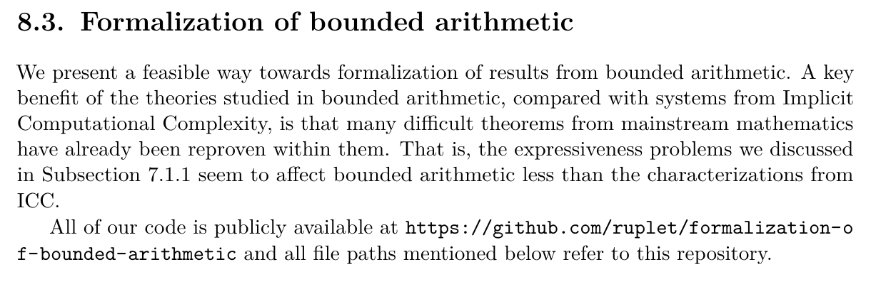

> Linia 4 po "Our contribution": "Theorem 8.1 and Theorem 8.2" - takie twierdzenia nie istnieją, są Lemma 8.1 and Lemma 8.2.
> W ogóle dlaczego jest osobna numeracja na definicje, a osobna na twierdzenia / lematy? W dodatku w innym stylu (z numerem podrozdziału lub bez). Lepiej niech będzie wspólna.

Gotowe! To niestety pozmieniało numerację... wszystkiego. Mam nadzieję że nie utrudni Ci to sprawdzania finalnej wersji.

> Akapit "In ... we present two very short, but very difficult.." jest niejasny, wymaga poprawy. Co to znaczy "macros that reduce them"? Czy chodzi o zapisanie indukcji jako comprehention, wspomniane gdzieś wcześniej, czy o coś całkiem innego.
> I jak to się ma do dalszej części akapitu - przejścia z "deeply embedded logical formula" do "property of Lean objects". W ogóle warto powiedzieć, czym jest "deeply embedded logical formula" - to nie jest wyjaśnione. O co chodzi z tym upraszczaniem "axiom scheme" przed rozpoczęciem dowodzenia.
> Dlaczego zawartość tego pliku pomaga.
> Trzeba to jakoś bardziej rozpisać:
> 1) axiom scheme jest dany jako...
> 2) aby na nim operować, musimy mieć...
> 3) ręcznie jest to żmudne...
> 4) używając biblioteki można to zrobić tak: ...

Zmieniłem trochę layout tekstu - wyjaśnienie makr jest wyżej.

> Ogólnie, całą tą formalizację dobrze byłoby lepiej wyjaśnić. Listing 8.1 coś tłumaczy, ale może jeszcze warto to napisać tekstem:
> * Definiujemy ArithModel (stałe 0,1, działania), gdzie jedyne co wiemy to że spełnia aksjomaty B1-B8. Oraz zasadę induckji (idelta0) - ? Zatem Lean nie może użyć swojej mocniejszej wiedzy o liczbach naturalnych, bo nie mówimy że ten ArithModel to liczby narutalne.
> * Aby zrobić indukcję tylko po odpowiednim rodzaju formuł, trzeba te formuły podawać syntaktycznie, a nie w składni Lean'a. Biblioteka tłumaczy taką syntaktycznie podaną formułę na własność Lean'a, a zarazem pozwala na indukcję po niej, bo ona jest z odpowiedniego fragmentu.
> * Jak udowodnisz, że spełnia założenia pierścienia, to możesz powołać się na różne dowody z biblioteki, mówiące coś o pierścieniach, itp.
> * ...
> Te rzeczy częściowo gdzieś się pojawiają, ale w formie uzasadnienia, że robimy tak a nie inaczej. Lepiej najpierw wprost opisać 1) co robimy, 2) jak to wszystko robimy, 3) dopiero potem coś uzasadniać.

Postarałem się żeby to poprawić.

> Druga rzecz wymagająca wyjaśnienia: jak się ma ta formalizacja do konceptu języka programowania? Że jak udowodnimy istnienie jakiejś funkcji w tej formalizacji, to znaczy, że da się ją obliczać w klasie... Jakiś przykład.

Osobny mail.

> Nazwy plików z myślnikami: wokół myślników nie powinno być spacji, a myślniki powinny być krótsze (dół strony 53, góra strony 54).

Racja. Użyłem niechący mathtt zamiast texttt. Teraz jest tak:

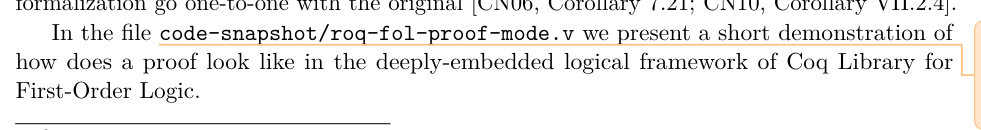

> Dół strony 53: Było o formalizacji w Lean, a teraz nagle coś o jakimś pliku w Coq - nie wiadomo jak się ma jedno do drugiego. Powinno być napisane na początku, że jest ta formalizacja w Lean, a oprócz tego coś robiłeś w Coq - potem opis jednego i potem opis drugiego. Teraz to jest przeplecione - po tym pliku w Coq, następny akapit jest znowu o Lean.

Przeniosłem dyskusję o tym że niektórych rzeczy niezrobimy w tej mojej formalizacji (a zrobimy w Rocq) wyżej;
remark tutaj:

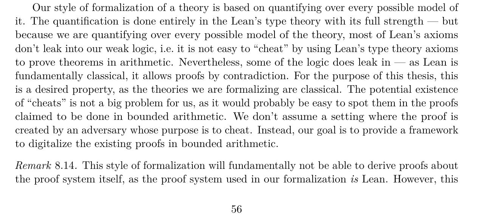

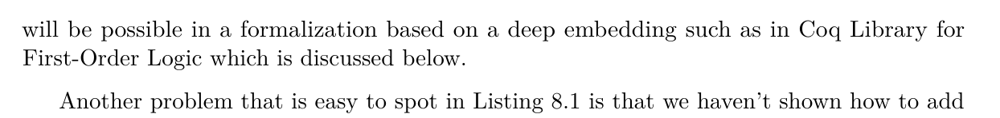

> Używasz zamiennie "Coq" i "Rocq" - niech będzie wszędzie Rocq, poza miejscem gdzie wyjaśniasz że wcześniejsza nazwa to Coq.

Tutaj pojawia się subtelność. Niestety wszystkie wyniki, o których wspomniałem w pracy, są dość stare i dotyczą Coqa.
Najczęśniej używam nazwy "Coq" w "Coq Library for First Order Logic" - a to jest konkretna nazwa tej biblioteki, dopóki oni jej nie zmienią to ja tez nie mogę. Zrobiłem z tego większy remark:

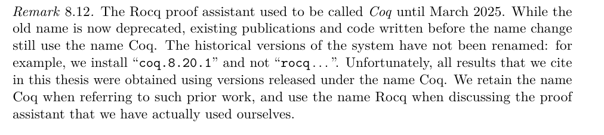

> "deep and shallow embeddings" - Wypadałoby napisać pokrótce czym jest jedno a czym drugie. Bo je porównujesz, a nie wiadomo co porównujesz.

Wprowadziłem te pojęcia w taki sposób w akapicie, w którym omawiam listing 8.1. Tutaj dodałem trochę tekstu (bardziej szczegółowy opis tego listingu), więc raczej polecam zerknąć do PDFa

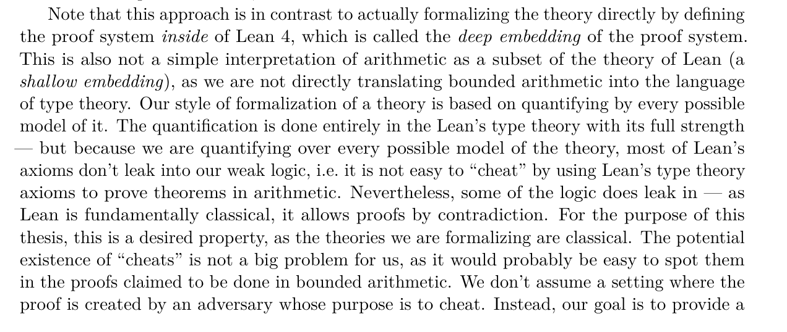

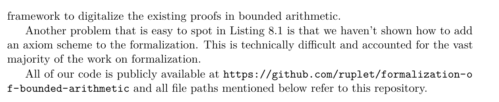

> Brak odniesienia do Listing 8.2 - warto wspomnieć w jakimś miejscu w tekście. Może też warto powiedzieć co tam się dzieje, w szczególności jak używamy indukcji (tzn wyjaśnić poszczególne konstrukty co one robią). Np tam jest jakieś display1, display2 - zatrzymałem się na tym, że niem co to jest.

Dodałem odniesienie przy okazji mówienia o makrach. W PDFie Ctrl+F: "A difficult technical problem we encounter".

> Tak, może tak być.
> Tylko niech będzie link do całego repo w rozdziale 8.

Link dodany zgodnie z jedną z uwag wyżej.

>> Głównie opisałem różne rzeczy, do których dotarłem, i problemy, które napotkalem po drodze. Myślę że wyświetlanie kodu Leana w pracy to zły pomysł, więc podałem tylko dwa dość ładne fragmenty.
> 
> To jest OK, nie ma sensu istotnie więcej fragmentów. Ale - tak jak pisałem wyżej - te fragmenty warto trochę wyjaśnić.

To świetnie.