> Niektóre podrozdziały mają ciągle TODO.

Dobra, rozwiązałem jedno z tych todo listując kilka powiązań między informatyką a matematyką w tym kontekście.
Nie wnikam w szczegóły, bardziej chciałbym nie zgubić tych referencji bo poświęciłem trochę czasu na eksplorowanie
tego połączenia które było dla mnie początkowo bardzo zaskakujące.

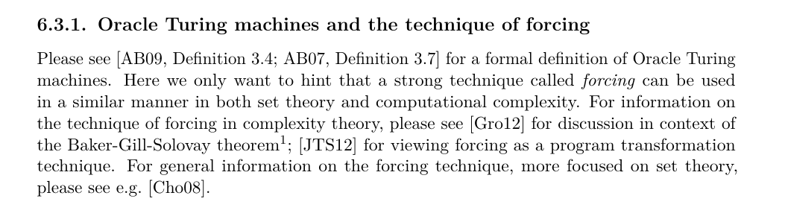

No i do tego dopisałem podrozdzialik oracle-oriented programming, który nie wprowadza nic nowego ale
jest dla mnie ważny, bo ten styl oracle-oriented programming miał być głównym celem pracy - niestety nie udalo się go
w tej magisterce zrealizować

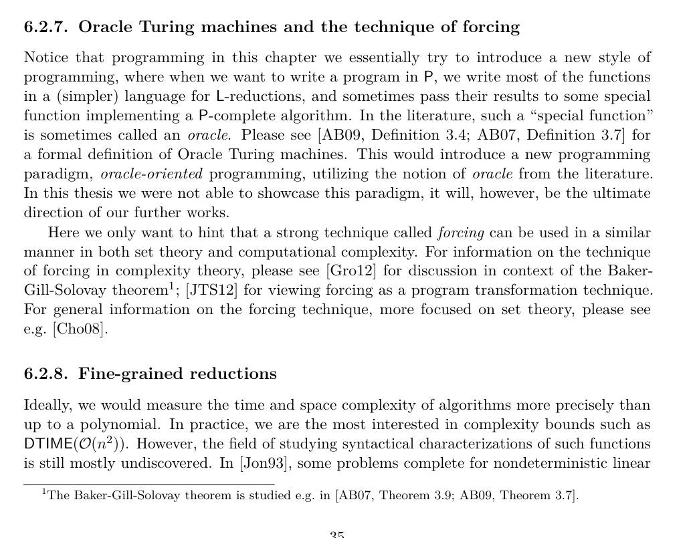

> Przynajmniej warto byłoby dać wcześniej jakieś motywacje, że chcemy zajmować się problemami funkcyjnymi. Nawet w Introduction, albo na początku obecnego rozdziału 3, który mógłby znaleźć się przed rozdziałem 2. Wtedy w Preliminaries mogłoby też znaleźć się coś o rzeczach funkcyjnych. Ale jak będą w Reductions, to też OK - bo w sumie teraz jest to tam dość sensownie ułożone, np ten przykład 6.3 ładnie coś pokazuje.

Dobra. Wprowadziłem takie zmiany: dodanie definicji do własnej sekcji w Preliminaries; modyfikacja początku rozdziału o reductions, żeby wskazywało na tę definicję (teraz funkcje są w sekcji 2.3, a decyzyjne się przesunęły do 2.4)

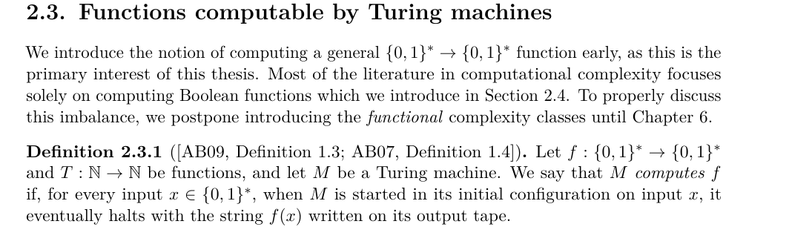

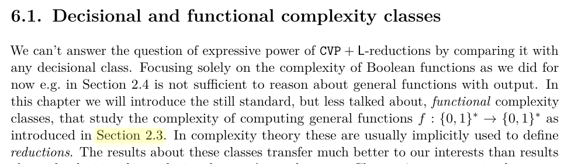

> Tuż nad rozdziałem 6.2: "in 6.2.2" -> "in Section 6.2.2"

Poprawione.

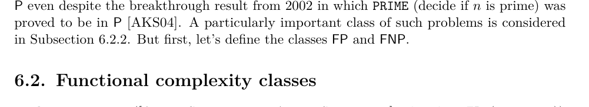

> Z definicjami 6.2.2 i 6.2.3 jest problem: przy obecnych definicjach FP nie zawiera się w FNP. Otóż w definicji 6.2.2 (FP) wymagamy jedynie, aby dla danego x dawało się szybko znajdować jakikolwiek y spełniający P(x,y) (lub stwierdzać, że taki y nie istnieje). Natomiast nie ma wymagania, że dla danych x,y da się sprawdzać, czy zachodzi P(x,y) - to może nawet być nieobliczalne (np. relacja P zawierająca wszystkie pary (x,0) oraz jakieś dziwne, nieobliczalne pary - dla każdego x można odpowiedzieć 0, ale nie da się sprawdzać czy dana para należy do P). Natomiast w definicji 6.2.3 (FNP) już ma istnieć weryfikator.
> Zajrzałem do cytowanej książki Rich'a - tam też jest ten problem. Tzn jest też definicja FNP z maszyną niedeterministyczną - ona znowu nie wymaga istnienia weryfikatora - ale jest też napisane, że jest ona równoważna takiej, co nie jest prawdą (z powodu np tej mojej relacji P opisanej powyżej). Tutaj odpowiednik w stylu z weryfikatorem wymagałby istnienia relacji P' zawartej w P - w punkcie (i) byłoby, że jeśli istnieje y spełniający P(x,y), to istnieje krótki y spełniający P'(x,y), a w punkcie (ii) byłby weryfikator dla P'. Przechodząc z maszyny niedeterministycznej, relacja P' zawierałaby tylko te pary, które faktycznie mogą być przez nią zwrócone.
> Nie sprawdziłem tych referencji [htta], [httb], [httc]. Natomiast zajrzałem do książki Papadimitriou "Computational Complexity" - on tam
> wymaga weryfikatora już również dla FP. Więc jak widać nie ma tutaj konsensusu. Trzeba coś wybrać, ale w spójny sposób.

Hmm.... rzeczywiście, pojawiła się tutaj niezgodność. Wydaje mi się że wystarczy dodać warunek że istnieje tylko jeden
wynik `y` dla każdego `x`. Tj. to jest tak naprawdę funkcja, nie relacja.

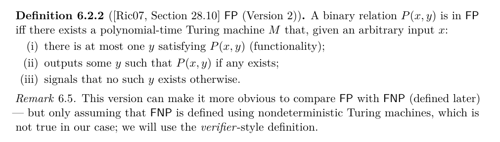

> Remark 6.6: "practically is practically" - Powtórenie. Dalej też coś poplątane chyba (zdanie gramatycznie się nie składa, a przynajmniej ja nie potrafię go sparsować).

Poprawione.

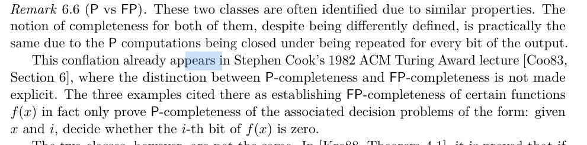

> Remark 6.6: Jak rozumiem, jeśli problem X jest P-zupełny, to następujący problem X' będzie FP-zupełny: dostajemy listę wejść do problemu X i mamy wypisać wynik dla każdego z nich. Bo wtedy tworzymy istancję X dla problemu decyzyjnego "daj mi i-ty bit" dla każdego i, pytając X' od razu o wszystkie te instancje. Natomiast sam problem X nie musi być FP-zupełny. Jeśli tak jest (a wydaje się, że tak), to warto coś takiego napisać. To chyba sporo wyjaśnia w kwestii różnicy między P-zupełnością a FP-zupełnością.

Wiesz co, nie chciałem w to wchodzić bo nie zdefiniowałem FP-zupełności... I w ogóle znalazłem tylko jedno miejsce
w którym ktoś odróżnia FP-zupełność od P-zupełności, ta praca cytowana tuż ponad sekcją 'FNP': [Coo85, Proposition 6.1].
Może to zostawię? Trochę się obawiam że coś się tutaj rozjedzie z definicjami jak zacznę w to wnikać (już teraz
mam w pracy dwie definicje FP i jak się okazuje, ani jedna ani druga nie jest dobra w zestawieniu z FNP).

> Poniżej: FP^SAT[O(log n)] - Co to jest? Trzeba zdefiniować (niekoniecznie jako osobna definicja, wystarczy tutaj w nawiasie napisać, że ta klasa to ...). O ile FP^SAT to w miarę standardowe, że chodzi o wyrocznię dla SAT, no to już ten nawias kwadratowy nie wiadomo co oznacza (sprawdziłem, że o liczbę zapytań do wyroczni chodzi). Druga sprawa to niespójność oznaczeń między FP^SAT[n^{O(1)}] a P^NP - jak rozumiem FP^SAT[n^{O(1)}] i FP^SAT (bez nawiasów) byłby tym samym, bo i tak maksymalnie n^{O(1)} pytań można zrobić. Więc albo ten [n^{O(1)}] w obu albo bez [n^{O(1)}] w obu. Jak również raz jest ^SAT, a raz ^NP - też chyba jest to to samo? Jeśli tak, to niech będzie to samo w obu napisane (a jeśli nie, to trzeba wyjaśnić różnicę). Swoją drogą w [Har] jest wymagane słabsze założenie, z FP^SAT[O(n)] zamiast FP^SAT[n^{O(1)}] - ale może nie ma sensu w to wnikać.

Dobra. Poprawiłem ten akapit:

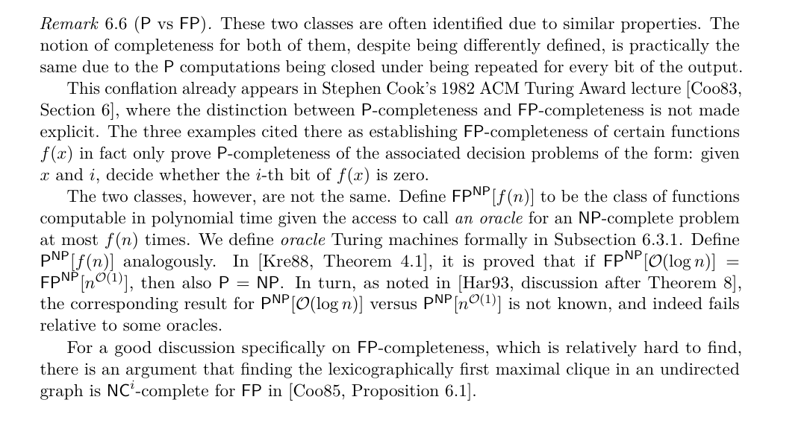

> [Har] - Gdzie rok? Niech będzie podany rok.

Gotowe.

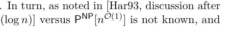

> [htta], [httb], ... - Dlaczego takie nazwy. Niech będzie od nazwiska i roku. Przypuszczam że teraz URL jest wpisany w nazwisku autora i dlatego bibtex takie dziwne nazwy tworzy.

> Def. 6.2.6: Zbędna spacja w "( [Gob11"

Gotowe.

> Def. 6.2.6: Jest błąd, trzeba coś jeszcze powiedzieć o istnieniu y-ków. Przy obecnej definicji można trywialnie zredukować cokolwiek do każdej relacji gdzie dla jakiegoś x nie istnieje y: mapuję każdy x na ten właśnie f(x) dla którego nie istnieje y, no i gotowe. (Taka definicja miałaby sens, gdyby FNP wymagało że dla każdego x istniało y, ale twoja definicja FNP tego nie wymaga, więc trzeba coś o istnieniu tu dopisać).

Hmm. Dobra, w tej oryginalnej definicj chyba było iff zamiast ->, a ja to źle przepisałem. Z iff jest chyba okej?

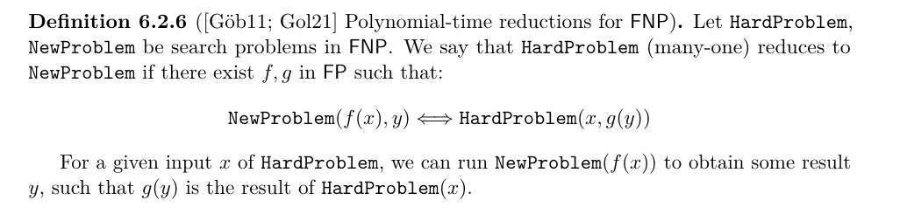

> Rozdział 6.2.6: "Some of... However, as ..." - Jak się mają te 2 zdania do siebie? Niejasne co tu chcemy powiedzieć. (wydaje się, że oba mówią w przybliżeniu to samo, więc dlaczego "however"?) Czy ten "characterized implicitly" miałoby oznaczać to samo co "syntactic", czyli istnienie problemu zupełnego? W szczególności w kontekście "less implicit" - co to miałoby być?

Dobra. Poprawiłem to tak:

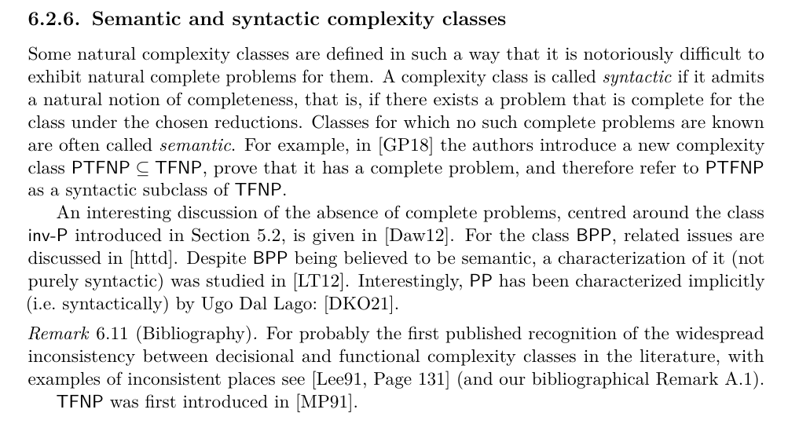

> Poniżej: "inv - P" - usunąć spacje wokół minusa (i może krótszy minus, zwykły hyphen).

Poprawione

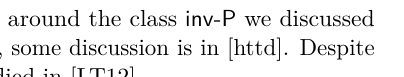