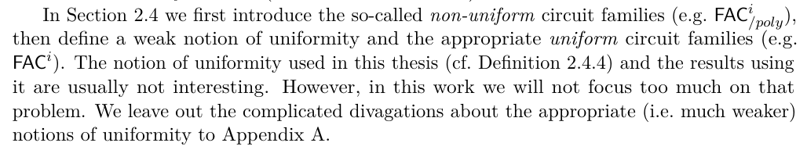
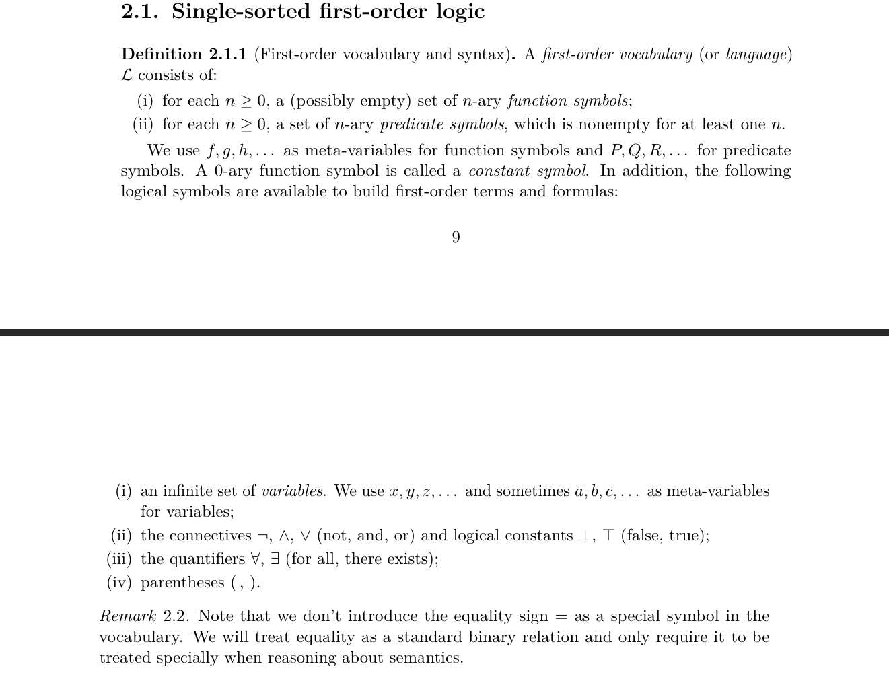
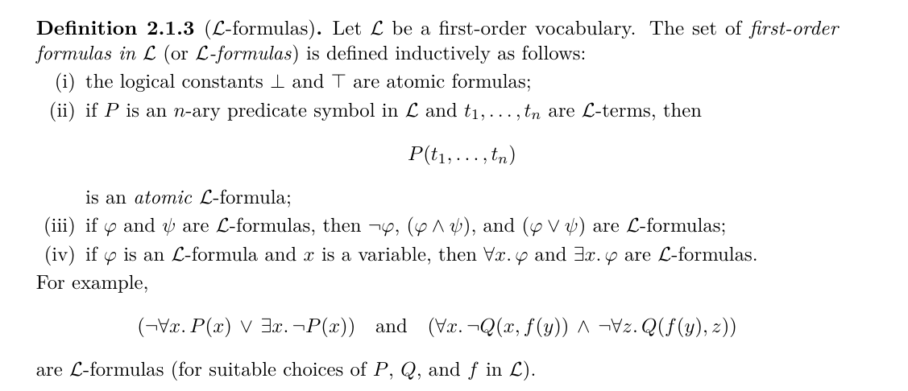
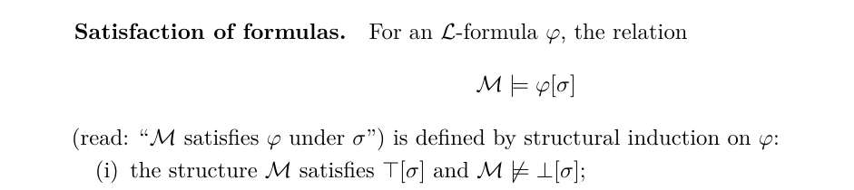
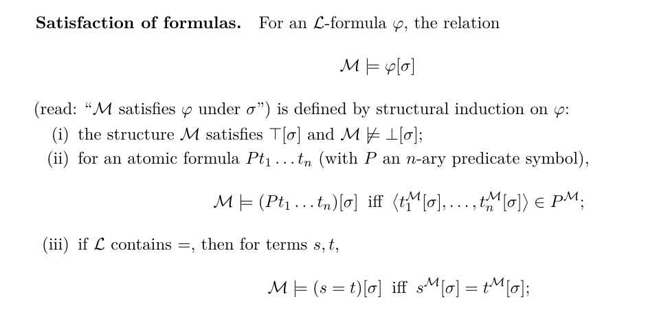
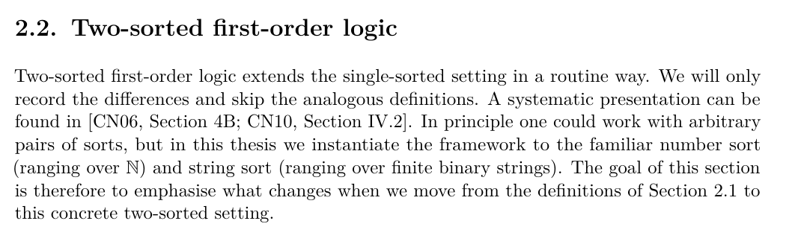
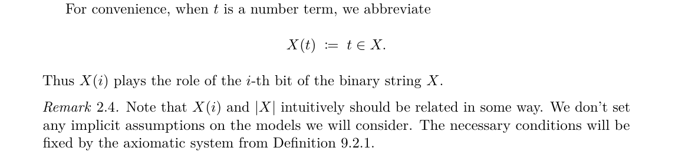
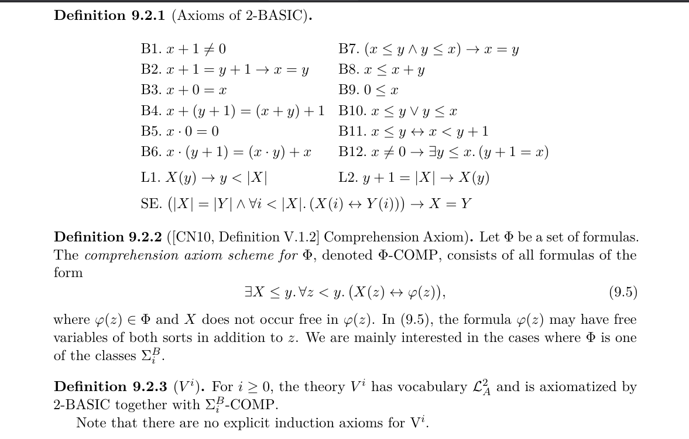
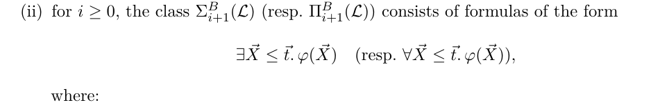
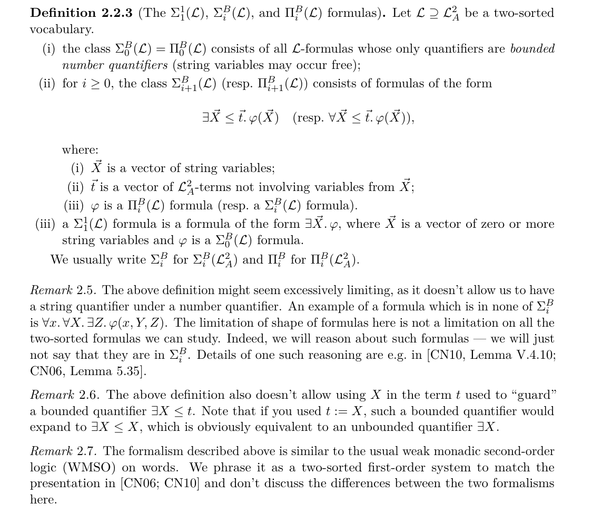

Cześć

Tymczasem komentarz do tego przez co już przeszedłem, czyli rozdziały 2.1-2.2:

> Akapit 1: "We solely focus..." - Zdanie to sugeruje (choć jak się wczytać to tego nie mówi), że jedyne wprowadzane rzeczy w tym rozdziale to logika pierwszego rzędu. Pasowałoby raczej napisać chociażby coś w stylu, "While defining logics, we solely focus...".

Poprawiłem na taki paragraf:

> Akapit 2: "The notion used in Definition 2.4.4..." - Co to za notion? Bez zajrzenia niezbyt wiadomo o co chodzi. Lepiej coś w stylu "The notion of uniformity used in this thesis (cf. Definition 2.4.4)..."

Poprawiłem to tak:

> Równość w FO: Zazwyczaj (o ile nie chcemy czegoś mówić o FO bez równości, co zdarza się bardzo rzadko) zakłada się, że równość nie jest specjalnym symbolem relacyjnym, ale jest po prostu dostępna w składni.
> Więc w def. 2.1.1 oraz 2.1.3 dodatkowo równość, a w def. 2.1.4 nie.
> Choć tak jak teraz też potencjalnie może być. Jest to jakoś trochę wyjaśnione w Remark 2.2. Ale może pasowałoby coś wspomnieć (że równość będziemy traktowali jak zwykłą relację) już po def. 2.1.1 - inaczej jak człowiek czyta to nabiera podejrzeń że coś jest źle.

Tutaj zrobiłem tak:

> Duża litera po średniku (w enumerate) - czy tak gdzieś widziałeś? Mi ten styl wydaje się dziwny, raczej bym dawał tam wszędzie małe litery.

Zrobione.

> W definicji 2.1.7 (i) wielka litera w nawiasie -> też raczej mała.

Zrobione.

> Używanie A,B na formuły dość dziwne. Gdzieś to już widziałem, ale raczej w starych tekstach (albo jakichś spoza mojej dziedziny). Współcześnie raczej \phi, \psi (tym bardziej że tak jest w dalszej części rozdziału - niech będzie spójnie).

Zrobione.

> Przykład pod 2.1.3: wcześniej było P(t1,...,tn) z nawiasami a tutaj Px bez nawiasów. Niech będzie spójnie. W "Pfyz" nie wiadomo czy y,z idą do f czy do P. Z arności P wynika, że y do f, a z do P. Raczej z nawiasami. Poza tym w drugiej formule inna litera zamiast P (obecnie nie mogą obie formuły na raz być L-formułami dla żadnego L, bo raz P unarne a raz binarne).

Zrobione.

> Def. 2.1.9 (i): po \top i \bot niech też będzie [\sigma].

Zrobione.

> Def. 2.1.9 (iii): - a tu jednak = nie jest relacją w M, ale jest traktowane specjalnie.

Zrobione:

> Sec. 2.2: Akapit 1 sugeruje, jakbyśmy nic nie mówili o logice 2-sortowej, a zaraz po nim miało nastąpić coś
> innego. Przeformułuj, aby był jaśniejszy (w stylu "pomijamy rzeczy podobne, a wypiszemy tylko różnice").
> Ponadto rozdziały 2.1 i 2.2 mają zupełnie inny charakter. W 2.1 jest logika nad dowolną sygnaturą, a w 2.2
konkretnie liczby i napisy. Pasuje coś powiedzieć na początku 2.2 - że choć logikę 2-sortową można ogólnie
definiować dla dowolnych sortów, to my piszemy tylko o tych konkretnych, liczby i napisy.
> I też właśnie trzeba konkretnie napisać, że sorty to liczby i napisy, przed Def. 2.2.1 - bo teraz w środku
> tej definicji nagle się pojawia coś o napisach i liczbach i nie wiadomo o co chodzi.

Napisałem to tak:

> Okolice Def. 2.2.2: Implicite zakładamy związek między |X| oraz t\in X, więc nie dowolna struktura tylko
> coś w stylu że nie zachodzi t\in X dla liczb >= |X|.

Tutaj nie mamy implicite założenia o modelach - ta zależność zostanie określona dopiero poprzez aksjomat.
Dopisałem remark.

Dla porządku zamieszczam od razu co to za definicja z rozdziału 9. o Bounded Arithmetic.

W kontekście dyskusji o tym że definicja 2.2.3 nie dopuszcza jakichś zmiennych / kwantyfikatorów po słowach
wewnątrz kwantyfikatorów po liczbach:
na tym screenie zamieszczam przy okazji schemat comprehension - będziemy wkładać do rozważanej teorii jako aksjomaty
jego instancje dla dowolnej formuły ze zbioru Sigma0B. Dlatego nie chcemy żeby te formuły były jakieś dziwne.
Moja intuicja jest taka że dla formuły `phi(z)`, która określa czy bit numer `z` wyniku jest 0 czy 1,
dla dowolnej długości $y$, możemy konstruować wynik $X$ długości $y$. Jeśli mielibyśmy w `phi` jakieś
kwantyfikatory po słowach, to chyba mogłoby to wpływać na powiązaną z tymi formułami złożoność obliczeniową.

> Często po kwantyfikatorach pisze się kropki: \forall x. \phi (z lekkim odstępem po kropce). Szczególnie
> byłoby to z korzyścią dla ograniczonych:
> \forall x<=t. \phi

Poprawione, wstawiłem wszędzie \ldotp

> Def. 2.2.3 (i) - zła czcionka L

Poprawione.

> Def. 2.2.3 (ii) - "not involving variables from X" - nasuwa się pytanie co by było, gdybyśmy dopuścili?
> Nic by się nie zmieniło. Więc warto gdzieś tam dopisać, że to tylko założenie dla porządku, które nic nie zmienia.

Tutaj np. to ma znaczenie o tyle że jeśli `t` może zawierać `X` po którym kwantyfikujemy, to jak podstawimy `t := X`,
to dostajemy kwantyfikację Exists X <= X, która już nie jest "bounded". Dopisałem remark - czy zgadzasz się z nim?
(pod spodem)

> Druga potencjalna modyfikacja to dopuszczenie kwantyfikatorów po liczbach między tymi po napisach.
> Obecnie w ogóle nie może być kwantyfikatora po napisie wewnątrz takiego po liczbie. To istotne?
> Warto to napisać wprost jeszcze raz pod spodem.

Dopisałem remark, że te ograniczenia dotyczą tylko tej hierarchii formuł, a nie wszystkich formuł które możemy
rozważać.
(pod spodem)

> Ostatnie zdanie rozdziału, o MSO: w MSO na słowach skończonych też kwantyfikujemy po zbiorach skończonych.
> Więc oprócz tego, że zbiory są skończone warto napisać, że "pomimo iż liczby są z nieskończonego zbioru
> liczb naturalnych" (w sumie też nigdzie nie jest napisane, że to liczby naturalne, a nie całkowite,
> wymierne, czy jeszcze jakieś inne).
> W tym kontekście używa się często nazwy WMSO (weak MSO) - czy ona nie byłaby odpowiednia?

Cenna uwaga. Te formalizmy rzeczywiście wydają się identyczne, a nigdzie w ogóle czytając o arytmetyce ograniczonej
nie natrafiłem na powiązanie z WMSO. Raczej już tego nie zdążę niestety zgłębić a szkoda, bo na MIMie łatwiej by
się rozmawiało o WMSO niż o jakiejś dwu-sortowej logice.
Dopisałem taki remark:

> Tymczasem tyle.

Dzięki!