> Rozdział 2.3, akapit 1: można dopisać, że w rozdziale X pojawią się warianty funkcyjne tych klas.

Gotowe:

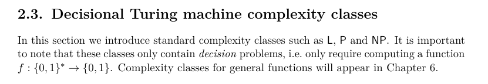

> Definicja 2.3.1: Właściwie, aby było całkiem poprawnie, trzebaby napisać, że "of length n >= n_0 for some constants c and n_0". Inaczej problem dla n=0 (np maszyna dla DTIME(n) musiałaby dla pustego słowa robić 0 kroków, a chyba zawsze robi co najmniej 1). W zasadzie można "n >= 1", ale chyba z "n >= n_0" jest ładniej.
> To samo w 2.3.2.

Gotowe:

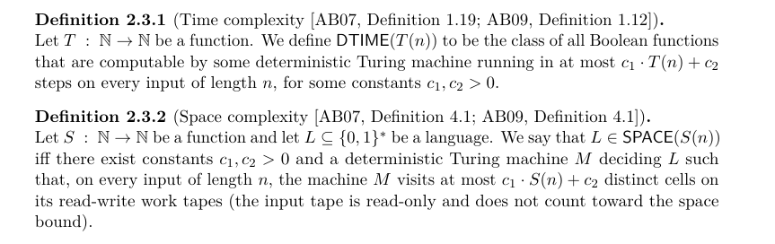

> Def. 2.4.2, linia 3: powinno być C_{|x|}(x), a nie C_n(x), bo nie wiadomo czym jest n.

Poprawione. Zmieniła mi się numeracja o 1 przez to że usunąłem pusty block \begin{definition} w ktorym było tylko
todo na zdefiniowanie obwodów.

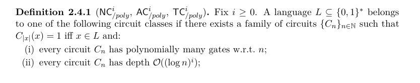

> Nad Def. 2.4.3: "in Definition 2.4.5" - tu raczej powinno być 2.4.3.

Faktycznie. Zmieniłem na definicję obwodów z wieloma outputami:

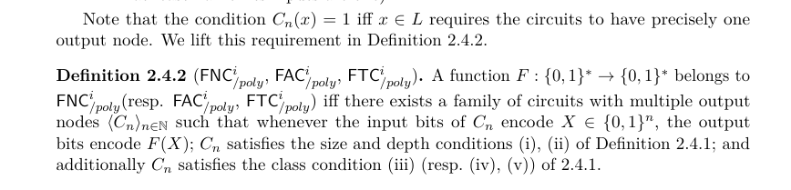

> Def. 2.4.5: W nawiasie są też decyzyjne NC^i itp, ale w treści definicji już tylko funkcyjne.

Poprawione.

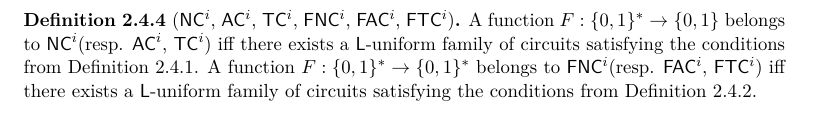

> Rozdział 3, akapit 2, końcówka: "random computation" - lepiej "randomized" (no chyba że chodzi o random access memory zamiast taśmy - to nie jest jednoznaczne). Również niejasne "real Turing machines" - czyli "prawdziwe"? Zapewne chodzi o liczby rzeczywiste, ale to nie jest jasne.

Poprawione.

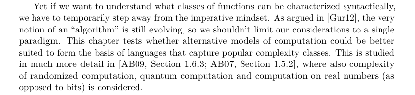

> W rozdziale 3.1 nagle coś o funkcjach - w bardzo nienaturalny sposób wprowadzone te funkcje. Pasowałoby napisać coś wprowadzającego, że w praktyce programy wypisują jakieś wyniki, a nie tylko mówią TAK/NIE, więc chcemy rozważać (i to pasowałoby nie w podrozdziale o automatach, ale przed nim, w części ogólnej).

Dobra, zrobiłem to jakoś tak, daj znać co myślisz.

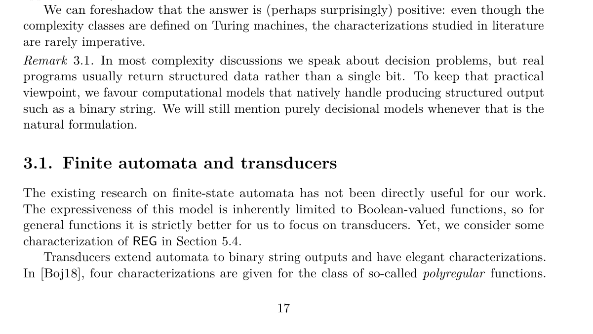

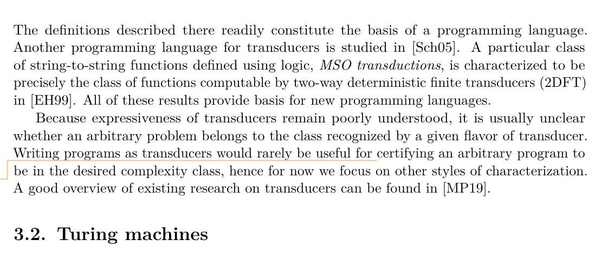

> Dół strony 15: "Because transducer classes remain poorly understood" - może lepiej trochę bardziej konkretnie: "Because expressiveness of transducers remains poorly understood" (?)

Zrobione.

> Pierwsza linijka strony 16: "writing programs as transducers" - czy chodzi o zapis w składni transducerów (np 2DFT), czy ogólniej o te wspomniane języki równoważne transducerow? To zdanie zdaje się stać w sprzeczności z "All of those results ... are more than relevant to our work".
> Akapit poniżej "The existing..." - Jakie jest przesłanie tego akapitu? Dlaczego nagle znowu o TAK/NIE? To już lepiej odwrotnie: najpierw automaty TAK/NIE -> niezbyt przydatne -> potem funkcje.

Zrobione, faktycznie kiepsko to brzmiało.

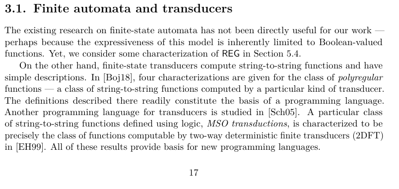

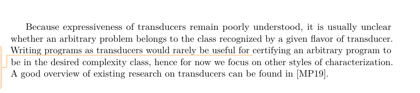

> Rozdział 3.2.1, akapit 1: pointer tape raczej nie tylko do oglądania inputu, ale także do zapisu/odczytu do pamięci roboczej.
> Rozdział 3.2.1, linia 6: "DTIME(n) Definition 2.3.1 or DTIME(n^2)" - coś tu się popsuło.
> Rozdział 3.2.1, końcówka: "??".
> Rozdział 3.2.1, końcówka: "also" - Czyli also jak co? Bo DTIME(n) czy DTIME(n^2) w definicji 2.3.1 były zdefiniowane bez wspominania o random access, więc raczej (domyślnie) dla zwykłej maszyny Turinga.

Zmieniłem to na taki tekst:

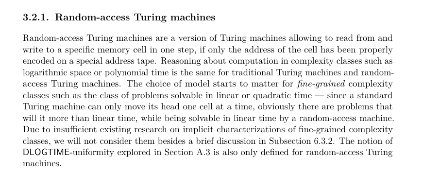

> Rozdział 3.4: "... are characterized. Characterizations of ..." - trzeba dopisać, że charakteryzacje używające tych discrete differential equations, bo teraz to zupełnie nie wynika z tych zdań.

Poprawione.

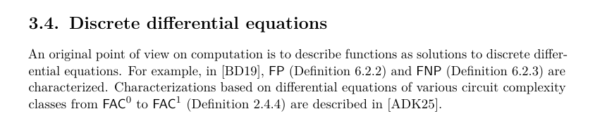

> Rozdział 3 ogólnie: Jaka jest rola tego rozdziału? Do rozważenia, ale moim zdaniem pasuje on raczej przed rozdziałem 2, jako nieformalne wprowadzenie, opis różnych opcji + co będzie dalej. A odwołań do rzeczy definiowanych w rozdziale 2 praktycznie tu nie ma.

Ten rozdział ma parę zadań. Jednym jest omówienie podejść do problemu, na które poświęciłem tak mało czasu
że nie mogę zrobić dla nich osobnego rozdziału, a jednak są istotne dla kompletności rozważań.
Np. transduktory - sporą luką by było nieomówienie ich. Drugie zadanie jest takie żeby nadać strukturę rozdziałom,
które potem następują - one zdają się mówić o dość losowych zagadnieniach, w każdym rozdziale jest omawiana inna
dziedzina informatyki. Chciałem pokazać że to co łączy te rozdziały to to, że w pewnym sensie omawiamy
inne paradygmaty programowania w różnych rozdziałach. Nie jestem pewien czy to zadanie się udało. Jednocześnie
ten rozdział ma chyba zbyt dużo zawartości jak na wstęp.

> Strona 18, bliżej dołu: "6.2.2" -> "Section 6.2.2", podobnie "9.1.1" poniżej.

Poprawione.

> Rozdział 4, "Representation...", akapit 2: Przy tej okazji można też wspomnieć o Liquid Haskel (w ostatnich latach powstała też wersja dla rust: https://dl.acm.org/doi/10.1145/3591283

Zrobione:

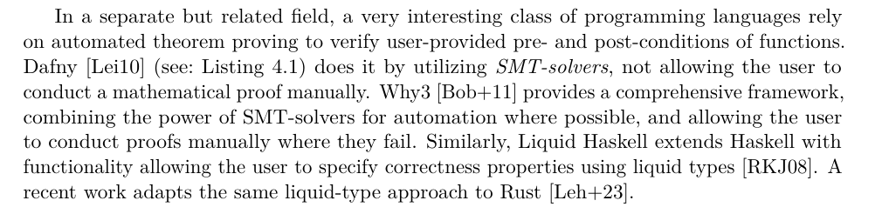

> Rozdział 5: "this book" - raczej "this thesis"

Poprawione.

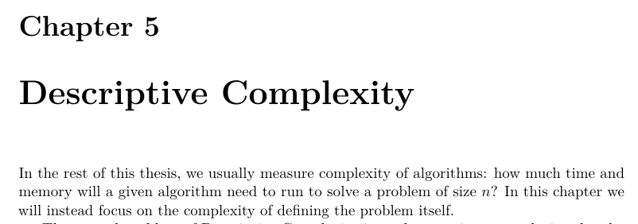

> Def. 5.0.3: Chyba \varphi ładniejsze niż \phi

Poprawione.

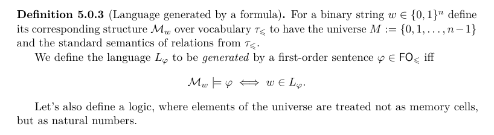

> Def. 5.0.4: Czym jest "SUCC"?
> Def. 5.0.4: Także Zero(x), One(x) - inaczej nie mamy dostępu do wejściowej struktury.
> Def. 5.0.4: natural numbers 0,1,... - Ale tylko ze skończonego modelu. Teraz to sugeruje, że mamy dowolne liczby (np możemy po nich kwantyfikować). Można "universe M" i potem "0,1,...,|M|-1".
> Remark 5.4 (TODO): Czy różnica jest taka, że w FO_BIT without BIT są jeszcze 0,1,max,SUCC, a w FO_<= ich nie ma? Wtedy jasne, że wychodzi to samo, bo te rzeczy (0,1,max,SUCC) można łatwo zdefiniować za pomocą porządku.
> Rozdział 5.2: "we removed the <=" - ale też SUCC, BIT, 0, 1 (wszystko co się odnosi do porządku). Za to potrzebne są jakieś inne relacje, np. (co najmniej) krawędzie grafu - inaczej mielibyśmy nieuporządkowany zbiór.
> Akapit pod def. 5.2.1 "By a result..." - tutaj FO[LFP] nadal z porządkiem (pierwszy akapit sugeruje, że bez porządku).
> Kolejny akapit: "does not capture P" - ale tylko order-invariant P (jak logika nie ma porządku, to jasne że nie zrobi własności zależnych od porządku np pierwszy bit to 1 - trywialne dla maszyny Turinga czytającej słowo od lewej). Zresztą widzę tu invP tuż niżej. Trzeba to dobrze opisać, aby było jasne jaka jest właściwa definicja. Zapewne logika ma dostęp bezpośrednio do struktury, a maszyna Turinga do kodowania struktury w napisie.

Tutaj odsyłam do PDFa.

> Rozdział 5.3.2, końcówka przedostatniej linii: zbędna spacja między nawiasami w "( [CN10,"

Poprawione.

> Ostatnia linia strony 25: "different anything" -> "different than anything". Ale czy naprawdę? Na pierwszy rzut oka wydają się blisko związane z FO-redukcjami.

Poprawione. Być może jest jakieś twierdzenie o tym że FO transdukcje i FO redukcje (tj. 'FO queries' Immermana)
są blisko, ale nie widziałem takiego (nie wnikałem głęboko). Tak z definicji to ja tego zupełnie nie widzę, te FO transdukcje to, podobnie jak MSO transdukje, złożenia kopiowania, kolorowania i interpretacji. A FO-redukcje to
jakieś tuple formuł. Skomplikowana jest ta definicja FO-redukcji, nie widzę takiego jasnego związku z FO-transdukcjami. Zamieszczam na screenie fragment tej definicji z Immermana

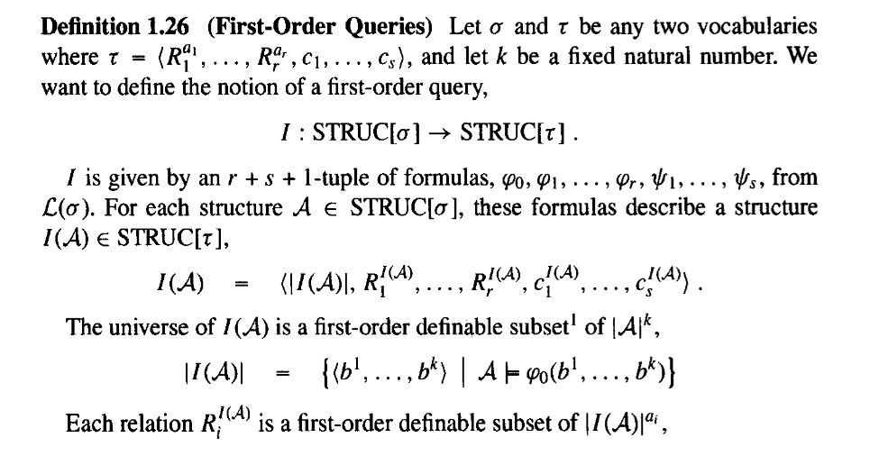

> Tw. 5.7 / Remark 5.8: Czy tu mówimy o słowach skończonych (można dopisać). Raczej znane jako Büchi-Elgot-Trakhtenbrot theorem (jest też praca Trakhtenbrota o tym). Cytowanie Buchiego ma mylący rok - to jakieś "collected works", a oryginalna praca była z 1960 bodajże.

Poprawiłem rok. Może rzeczywiście wypada zacytować Trakhtenbrota. Raz na seminarium Jaio, bardziej na żarty,
dyskutowaliśmy o tym czy dalej chcemy uwzględniać Trakhtenbrota ze względu na jego rosyjskie pochodzenie.
Ale u mnie to bardziej wygląda na zwykły błąd niż na jakieś celowe pominięcie, więc dopiszę go.

Nie mogę niestety zlokalizować tłumaczenia tej pracy, które podobno AMS wydało w 1966. Znalazłem
tylko jakiegoś pdfa po rosyjsku (oryginał). Trudno, wstawiłem jakieś cytowanie:

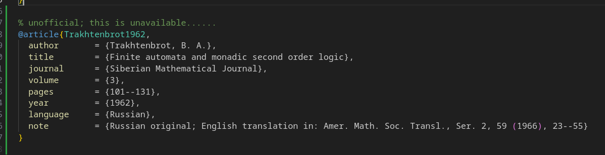

> Strona 27: "properly properly" - powtórzenie

Poprawione, dzięki.